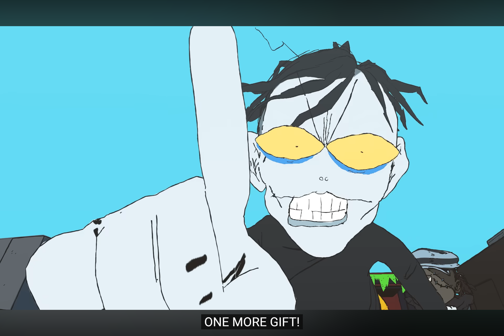

Space Shmup
=====================

# Requirements for the project
* Finished the book tutorial for Space Shmup
* Number of enemies increased to 5
* Enemy comes into contact with Hero ship damage is taken
* Hero is able to shoot
* Scorlling starfield background

# Enhancements
Inlcuding to the weapons that the book instructions gone through, i also added code for a homing missile, and a phaser.
I added a score counter and a high score that gets tranfered to the game over screen.
I added sound to when the Hero ship shoots, an enemy gets destroyed, and when a power up appears
